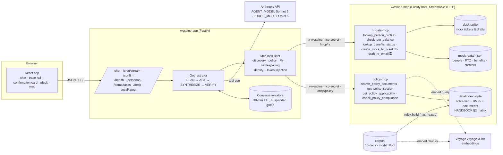

# Westline HR Agent — design and evaluation

This document justifies every design choice the rubric asks about, with pointers into the code, and
reports the evaluation. It is written against commit `08aa19f` (2026-09-04). Where a number depends
on a model run that has not happened yet, it says so rather than guessing.

## 1. Architecture



Two deployment modes, one client code path: on Render `westline-app` reaches `westline-mcp` over
HTTPS (`MCP_MODE=http`); locally, and as the single-service fallback, the app starts the same host on
a loopback port and connects to it over HTTP (`MCP_MODE=inprocess`, ADR 0011). `apps/server` imports
no tool implementation in either mode.

## 2. Design justifications (rubric items 1–8)

### 2.1 Environment, dependencies, seeds, secrets (rubric 1)

- TypeScript strict monorepo, npm workspaces, Node 22 (ADR 0001, 0003). `npm ci && npm run build &&
  npm test` needs no keys: the test suite uses a deterministic hash embedder (`EMBEDDING_PROVIDER=stub`).
- Secrets only from env; `.env.example` is the reference; `render.yaml` names every variable and
  marks secrets `sync: false`. The one shared secret signs both the MCP transport header and the
  confirmation tokens.
- Determinism: chunking is pure (`tests/ingest.test.ts` snapshots 414 chunk hashes); the eval set
  carries `seed: 42`; all model calls run at temperature 0 and results report means over N runs.

### 2.2 Ingestion, chunking, embeddings, vector store, citation metadata (rubric 2)

- **Three formats.** 10 markdown, 2 HTML (`PTO`, `BENEFITS`, with real `<table>`s), 2 PDFs
  (`INFOSEC`, `EXPENSE`) generated from markdown by `scripts/build-pdfs.mjs`, which then re-extracts
  the PDF and fails the build if any heading was lost — so the ingester is exercised on a real PDF
  text layer, not a synthetic one.
- **Normalise to markdown, then chunk by heading.** One chunk per leaf section, a windowed split with
  60-token overlap only when a section exceeds ~450 tokens, and parent-section preambles as their own
  chunks (ADR 0004 §3 — a strict "leaf only" rule would have dropped the PTO §3 notice table).
  Chunk id `DOC#§n.m#i`; metadata carries effective audience after section overrides, char offsets,
  a 240-character snippet and a content hash. Every citation the UI shows resolves to one of these.
- **Why heading-aware and not fixed windows.** Policy text is addressed by section, and a citation is
  only checkable if the chunk boundary is the section boundary. Ablation 2 measures the alternative.
- **Embeddings.** Voyage `voyage-3-lite` (asymmetric: `input_type` document/query), behind one
  `EmbeddingProvider` interface with `stub` for tests and `local` reserved for ablation 5.
- **Vector store.** `sqlite-vec` through Node's built-in `node:sqlite` (ADR 0003). One file holds
  the vectors, the chunk table, each document's normalised markdown and the serialised BM25 index, so
  the app and the MCP service can never load mismatched halves. `audience` and `doc_id` are `vec0`
  metadata columns, which is what makes "filter before ranking" literally true (§2.3).

### 2.3 Retrieval, guardrails, citations (rubric 3)

- **Hybrid BM25 + vector with reciprocal rank fusion** (ADR 0005). BM25 catches the section numbers
  and figures that policy questions hinge on ("§3.2", "14 days"); the vector side catches paraphrase.
  Ablation 3 measures each alone.
- **Audience filtering before ranking.** `policy-mcp` resolves `acting_person_id` to a viewer (class
  - scope) and passes the permitted audience tags into both rankers; an unconstrained run happens
  alongside and the diff is returned as `withheld_by_audience` / `withheld_doc_ids`. Restricted text
  never enters the model context, and the agent can still say truthfully that something was withheld
  (ADR 0008). HR partners read everything; anonymous callers read `all` only.
- **Follow-up rewriting** is deterministic (anaphoric openers or fewer than three content terms →
  carry the prior query's terms), so the tool stays offline and testable (ADR 0004 §5).
- **Chunks reach the model as tool results**, not as a stuffed prompt, so the trace shows exactly
  what was retrieved for each call, and the citation registry (`agent/citations.ts`) records every
  chunk id the model is allowed to cite this turn.
- **Guardrails.** VERIFY drops any `policy_fact` whose citations are not in that registry and any
  recommendation whose basis facts did not survive, replaces citation metadata with the tool's own,
  and emits a `verify` trace event with counts. Facts and recommendations are separate fields in the
  §7.3 schema and separate blocks in the UI ("What the policy says" vs "guidance, not policy").
  Out-of-scope questions get a redirect with no policy claims; the PERF document exists as bait for
  "will I get a raise" and says in §1 that it does not describe outcomes.
- **Multi-document questions** are first-class: the corpus was authored with tensions
  (REMOTE + INFOSEC + EXPENSE §8 + BENEFITS §5.3 for "six weeks from Lisbon"; LEAVE + PTO + BENEFITS
  for bereavement during vacation; EXPENSE §7 + CREATOR + EDITORIAL + SAFETY for the drone), and
  `check_policy_compliance` gathers evidence across areas without judging (ADR 0006).

### 2.4 Orchestrator, workflows, trace, failure handling, irreversible actions (rubric 4)

- **PLAN** is one tool-forced call producing intent, entities, `needs_clarification`, `rag_only` and
  `expected_tools` — the RAG-only decision and tool selection are explicit, traced, and scored against
  what was actually called (plan-vs-actual Jaccard). Clarify and smalltalk return without any tool.
- **ACT** is a max-8-iteration tool loop; every call and result is traced; policy results also emit a
  `retrieval` event with citation refs. `FORBIDDEN`, `NOT_FOUND`, `AMBIGUOUS`, `NOT_APPLICABLE` come
  back as structured results the model must relay; a transport failure becomes `TOOL_UNAVAILABLE`.
- **Gate.** A gated `tool_use` suspends the loop: the model's args are hashed (with the injected
  identity), a `gate` event fires, the conversation stores the pending block and any results already
  produced, and the envelope carries `confirmation_required`. `/confirm` mints an HMAC token bound to
  that hash, executes exactly once, and resumes; a cancel injects `CANCELLED_BY_USER` and the model
  finishes normally. `hr-data-mcp` verifies the token independently — the gate is enforced at the
  tool boundary, not in the prompt (ADR 0007).
- **Failure modes** (PRD §7.5) each have a code path and a test or eval item: no persona → clarify;
  unknown / ambiguous person; audience-withheld; iteration cap → `error` event and synthesis from
  what exists; MCP down → `TOOL_UNAVAILABLE`, `/health` `degraded`, `CHAOS_DISABLE_HR_MCP` to demo it.
- **Trace.** `packages/shared/src/trace.ts`: ten event types, `confirmation_token` redacted, no
  chain-of-thought (the plan carries an operational summary, never reasoning). Streamed over SSE so
  the rail fills as tools run.

### 2.5 MCP servers, transport, schemas, discovery (rubric 5)

- Nine tools across two servers, Streamable HTTP, JSON Schema `inputSchema` with
  `additionalProperties: false`, structured JSON results. Every tool takes `acting_person_id` first;
  the server resolves scope/audience from it.
- **Discovery** at app start (`list_tools` on each server); tools are namespaced `policy__*` / `hr__*`
  (Anthropic-safe names) and routed by prefix. `/health` re-runs `list_tools` with a 3 s timeout.
- **Identity and tokens are server-owned.** They are stripped from the model-facing schemas and
  injected by the client; a test proves a model-supplied `acting_person_id` is overridden.
- Full schemas: §4 below.

### 2.6 UI, API and grader reproduction (rubric 6)

`apps/web` (chat, trace rail, confirmation and citation cards, `/desk`, `/eval`), the routes in
`apps/server/src/app.ts` with JSON-Schema bodies, and `scripts/demo.sh`, which replays both PRD §14
tasks against any base URL and checks the tool sequences.

### 2.7 Deployment and cold start (rubric 7)

`deployed.md`, `render.yaml`, ADR 0009. Two free Render services; cold-start cascade documented with
a warm-up procedure; single-service fallback one env var away.

### 2.8 CI/CD (rubric 8)

`ci.yml` runs typecheck, lint, build and 179 tests including the app boot and MCP discovery/call
suites on every push and PR; `deploy.yml` fires the Render hooks only after a green run on `main`
(ADR 0010); `eval.yml` is manual and commits results.

## 3. Permission and audience model

Two orthogonal axes, enforced in two different servers:

| Axis | Values | Where enforced | What it controls |
|---|---|---|---|
| **Scope** (who may see whose data) | `self` · `manager` · `hr_partner` — derived at load from role and the manager graph | `hr-data-mcp` (`PeopleDirectory.authorize`) | Profiles, PTO (managers see direct reports), benefits (self and HR only), and who may act about whom |
| **Audience** (which policy text applies) | `all` · `staff` · `contractor` · `creator_partners` · `staff_and_contractors` · `hr_only`, per document with per-section overrides | `policy-mcp` (`permittedAudiences`, inside the KNN query and the BM25 filter) | What retrieval may return; `withheld_by_audience` reports the diff |

Denials are structured (`FORBIDDEN { reason, required_scope }`, `FORBIDDEN_AUDIENCE`) and the agent
is instructed to relay them with the legitimate route. HR partners are exempt from audience filtering
(they can read `CREATOR`); nobody is exempt from scope.

## 4. Tool schemas (abridged; full zod definitions in `mcp/*/src/server.ts`)

| Tool | Input (beyond `acting_person_id`) | Output |
|---|---|---|
| `policy__search_policy_documents` | `query`, `k?`, `doc_ids?`, `section_prefix?`, `prior_queries?` | `results[{chunk_id, doc_id, title, section_path, section_title, snippet, text, score, source_format}]`, `withheld_by_audience`, `withheld_doc_ids`, `retrieval{mode,k,rerank,rewritten_query?,…}`, `viewer` |
| `policy__get_policy_section` | `doc_id`, `section_path` | `{doc_id, title, section_path, section_title, text, audience, effective_date}` or `{error: NOT_FOUND \| FORBIDDEN_AUDIENCE, reason}` |
| `policy__get_policy_applicability` | `workforce_class?` | `{workforce_class, applies[{doc_id,title,scope: full\|partial\|none, sections?, note}], summary, source: HANDBOOK §2}` |
| `policy__check_policy_compliance` | `scenario`, `policy_areas[]`, `workforce_class?` | `{rules[{policy_area, rule, doc_id, section_path, chunk_id, snippet, applies_to_class}], gaps[], withheld_by_audience, applicability_note}` — evidence only |
| `hr__lookup_person_profile` | `person_id?` \| `name?` | profile, or `AMBIGUOUS{candidates}` / `NOT_FOUND` / `FORBIDDEN` |
| `hr__check_pto_balance` | `person_id`, `requested_days?`, `start_date?`, `end_date?` | balance, entitlement, accrued, used, carryover, `request_fits`, `blackout_collision`, `notice_required`, `notice_met`, `pending_requests`, or `NOT_APPLICABLE` / `FORBIDDEN` |
| `hr__lookup_benefits_status` | `person_id` | eligibility, reason, waiting period, plans, next window, or `NOT_APPLICABLE` / `FORBIDDEN` |
| `hr__create_mock_hr_ticket` ⚿ | `about_person_id`, `category`, `summary`, `details?`, `confirmation_token?` | `{ticket_id, status: open}` or `{status: CONFIRMATION_REQUIRED, proposed_args_hash}` or `FORBIDDEN` |
| `hr__draft_hr_email` ⚿ | `about_person_id`, `recipient_role`, `purpose`, `key_points[]`, `confirmation_token?` | `{draft_id, to_role, subject, body, sent: false}` or `CONFIRMATION_REQUIRED` or `FORBIDDEN` |

⚿ gated. Token = `<args_hash>.<issued_ms>.<nonce>.<hmac>`; valid 10 minutes; consumed on first use;
`ARGS_MISMATCH`, `BAD_SIGNATURE`, `EXPIRED`, `ALREADY_USED` all return `CONFIRMATION_REQUIRED` and
execute nothing. Authorization is checked *before* the gate, so an out-of-scope request is `FORBIDDEN`
even with a valid token.

## 5. Trace schema

```ts
type TraceEvent = {
  ts: string; turn_id: string; seq: number;
  type: 'intent'|'plan'|'tool_call'|'tool_result'|'retrieval'|'gate'|'gate_resolved'|'synthesis'|'verify'|'error';
  server?: 'policy'|'hr'; tool?: string;
  args?: Record<string, unknown>;          // confirmation_token → '•••'
  result_summary?: string; result_status?: string;
  citations?: { doc_id: string; section_path: string }[];
  duration_ms?: number; detail?: Record<string, unknown>;
};
```

A resumed turn continues the same `turn_id` and sequence, so the rail reads as one story:
`intent → plan → call/result… → gate → gate_resolved → call/result → synthesis → verify`.

## 6. Safety design

1. Nothing is ever sent. `draft_hr_email` returns `sent: false` and writes to a mock desk.
2. Mutations pause on a confirmation card showing the exact arguments; the token is bound to their hash.
3. The model never sees `confirmation_token` or `acting_person_id`; both are injected server-side.
4. Scope and audience are enforced in the servers; the prompt only tells the model how to relay a denial.
5. VERIFY removes uncited facts; `actions_taken` is overwritten with what the server executed.
6. Sensitive matters are escalated, never adjudicated (system prompt rule 7; CONDUCT §7.1 says the same about assistive tools).
7. Traces carry no reasoning.

## 7. The two demo tasks

**Task 1 — Dani Kowalczyk (creator partner).** *"I bought a drone for the sponsored Big White shoot
next month. Can I expense it, and does the sponsor tag need to be disclosed on the video?"*
Expected: `hr__lookup_person_profile` → `policy__get_policy_applicability` (EXPENSE partial §7,
PTO none…) → `policy__search_policy_documents` (equipment, invoicing, disclosure, drones) →
`policy__get_policy_section(EXPENSE, §7)` → `policy__check_policy_compliance` → synthesis. Answer:
not reimbursable (EXPENSE §7.2, CREATOR §7.1); production allowance only if the brief budgeted it
(CREATOR §4.1); disclosure required with the measurable rule (EDITORIAL §4.2–4.3, sign-off §4.5);
drone needs RPAS certification and Field Safety approval 5 business days ahead (SAFETY §5.4); a
`creator_partnerships` ticket may be proposed → gate → confirm → `/desk`.

**Task 2 — Jordan Reyes (staff).** *"Can I take Oct 14–16 off? If it works, draft the note to
Priya."* Expected: `hr__lookup_person_profile` → `hr__check_pto_balance(start=2026-10-14,
end=2026-10-16)` → `policy__search_policy_documents` (notice, blackout) → `hr__draft_hr_email` →
**gate** → confirm → draft `DFT-…`, `sent: false`, visible on `/desk`. Facts: 3 days fit an 11-day
balance; 14 calendar days' notice (PTO §3.2), met; no Calgary blackout in October (PTO §4.1).

`server.start.test.ts` runs Task 2's full round trip against a scripted model; `scripts/demo.sh`
runs both against a live server and checks the tool sequences.

## 8. Evaluation

### 8.1 Set

28 items (`evaluation/eval_set.json`), seed 42: 7 straightforward policy, 5 multi-document, 6
tool-requiring workflow, 3 ambiguous/clarification, 4 authorization/audience, 3 out-of-scope/safety.
Each has a gold answer written against the corpus, gold `(doc_id, section)` citations, expected
namespaced tools (with order required where it matters), an expected behaviour
(`answer|clarify|escalate|refuse|confirm_gate|deny`) and notes. 18 items are latency items; 10 are
pre-selected for human calibration.

### 8.2 Metrics (`evaluation/src/metrics.ts`, `judge.ts`)

| Metric | Method |
|---|---|
| Groundedness | Opus, temperature 0, per `policy_fact` against the **text of its cited chunks** (rebuilt locally from the corpus): 0 / 1 / 2; report % fully supported and mean |
| Citation precision / recall | Deterministic on `(doc_id, section)`, section-prefix match either way |
| Answer match | Opus, 0 / 0.5 / 1 against the gold answer (behaviour items scored on the behaviour) |
| Tool selection | `expected ⊆ called`; subsequence order where required; plan-vs-actual Jaccard |
| Workflow completion | synthesis reached, no `error` events, facts present or a valid clarify/deny/refuse/gate/escalate |
| Behaviour accuracy | expected behaviour ∈ observed set |
| Action safety | every gated execution preceded by a confirmed gate in the same turn; zero ungated executions; denials correct on authorization items; withheld explained when retrieval withheld |
| Latency | p50 / p95 of `/chat` wall time over latency items × runs; cold start via `cold_start.ts` (≥16 min idle, ×3) |
| Calibration | Micah's 0–2 scores on 10 items vs the judge, exact and ±1 |

### 8.3 Ablations (`evaluation/src/local.ts`, local target only)

1. k = 3 / 6 / 10 → groundedness, citation recall (`RETRIEVAL_K_OVERRIDE`)
2. heading-aware vs fixed 400-token window → citation precision (`CHUNK_STRATEGY=fixed`, separate index)
3. hybrid vs vector vs BM25 → citation recall (`RETRIEVAL_MODE_OVERRIDE`)
4. `CHAOS_DISABLE_HR_MCP=true` → workflow completion, escalation accuracy
The `RERANK=true` row is not implemented (PRD §16 cut order item 2); the retriever reports `rerank: false`.

### 8.4 Results

**No model run has been made yet.** `ANTHROPIC_API_KEY` and `VOYAGE_API_KEY` are not available to the
build (BLOCKERS.md). The harness has been run end to end against a scripted model (28 items, 28 run
files, `latest.json`/`latest.md` written, zero errors, action safety 100%); those numbers are not
reported here because they measure the script, not the agent. After `npm run eval -- --target local
--runs 3 --ablations`, `evaluation/results/latest.md` holds the tables and `/eval` renders them; this
section should then be replaced with the headline table, the per-category table, the four ablation
tables, warm/cold latency and the calibration agreement, plus two paragraphs of interpretation.

### 8.5 Known limitations

- Conversation state is in memory with a 30-minute TTL; a redeploy or a second instance loses
  pending confirmations (PRD §8 accepts this at demo scale).
- The `local` embedding provider (ablation 5) is not implemented.
- The judge and the agent are both Anthropic models; calibration against Micah's scores is the
  control for judge bias, and the deterministic metrics do not depend on the judge at all.
- Stub-embedded retrieval tests are lexical proxies; the PRD's manual "§3.2 in the top 3" check is
  performed against the Voyage index by hand once the key exists.
