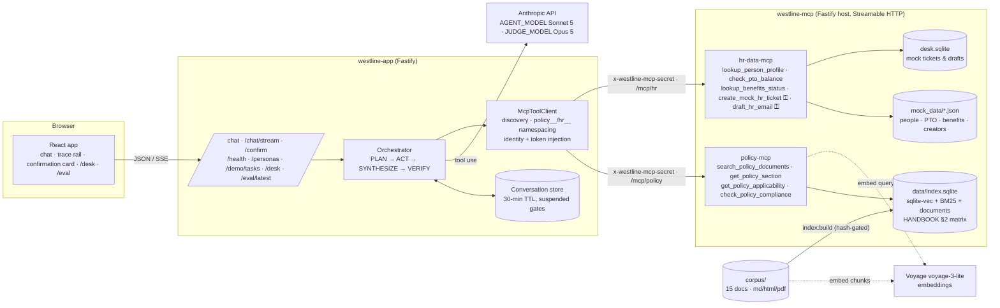

# Westline HR Agent — design and evaluation

This document justifies every design choice the rubric asks about, with pointers into the code, and
reports the evaluation. It is written against commit `08aa19f` (2026-09-04). Where a number depends
on a model run that has not happened yet, it says so rather than guessing.

## 1. Architecture



Two deployment modes, one client code path: on Render `westline-app` reaches `westline-mcp` over
HTTPS (`MCP_MODE=http`); locally, and as the single-service fallback, the app starts the same host on
a loopback port and connects to it over HTTP (`MCP_MODE=inprocess`, ADR 0011). `apps/server` imports
no tool implementation in either mode.

## 2. Design justifications (rubric items 1–8)

### 2.1 Environment, dependencies, seeds, secrets (rubric 1)

- TypeScript strict monorepo, npm workspaces, Node 22 (ADR 0001, 0003). `npm ci && npm run build &&
  npm test` needs no keys: the test suite uses a deterministic hash embedder (`EMBEDDING_PROVIDER=stub`).
- Secrets only from env; `.env.example` is the reference; `render.yaml` names every variable and
  marks secrets `sync: false`. The one shared secret signs both the MCP transport header and the
  confirmation tokens.
- Determinism: chunking is pure (`tests/ingest.test.ts` snapshots 457 chunk hashes); the eval set
  carries `seed: 42`; all model calls run at temperature 0 and results report means over N runs.

### 2.2 Ingestion, chunking, embeddings, vector store, citation metadata (rubric 2)

- **Three formats.** 11 markdown, 2 HTML (`PTO`, `BENEFITS`, with real `<table>`s), 2 PDFs
  (`INFOSEC`, `EXPENSE`) generated from markdown by `scripts/build-pdfs.mjs`, which then re-extracts
  the PDF and fails the build if any heading was lost — so the ingester is exercised on a real PDF
  text layer, not a synthetic one.
- **Normalise to markdown, then chunk by heading.** One chunk per leaf section, a windowed split with
  60-token overlap only when a section exceeds ~450 tokens, and parent-section preambles as their own
  chunks (ADR 0004 §3 — a strict "leaf only" rule would have dropped the PTO §3 notice table).
  Chunk id `DOC#§n.m#i`; metadata carries effective audience after section overrides, char offsets,
  a 240-character snippet and a content hash. Every citation the UI shows resolves to one of these.
- **Why heading-aware and not fixed windows.** Policy text is addressed by section, and a citation is
  only checkable if the chunk boundary is the section boundary. Ablation 2 measures the alternative.
- **Embeddings.** Voyage `voyage-3-lite` (asymmetric: `input_type` document/query), behind one
  `EmbeddingProvider` interface with `stub` for tests and `local` reserved for ablation 5.
- **Vector store.** `sqlite-vec` through Node's built-in `node:sqlite` (ADR 0003). One file holds
  the vectors, the chunk table, each document's normalised markdown and the serialised BM25 index, so
  the app and the MCP service can never load mismatched halves. `audience` and `doc_id` are `vec0`
  metadata columns, which is what makes "filter before ranking" literally true (§2.3).

### 2.3 Retrieval, guardrails, citations (rubric 3)

- **Hybrid BM25 + vector with reciprocal rank fusion** (ADR 0005). BM25 catches the section numbers
  and figures that policy questions hinge on ("§3.2", "14 days"); the vector side catches paraphrase.
  Ablation 3 measures each alone.
- **Why k = 6.** `DEFAULT_K` (`packages/rag/src/retrieve/retriever.ts:16`); the
  `search_policy_documents` schema lets a caller ask for 1–20. k governs what reaches the model, not
  what is considered: each ranker is asked for `max(20, k × 4)` candidates before fusion, so k = 6
  fuses 24 candidates per ranker down to 6 chunks out of 457, and the response reports both
  `candidates_considered` and `candidates_after_audience_filter` so the effect is visible in the
  trace rather than inferred. Three things make a modest default the right one here. k is per *call*,
  and a turn issues several targeted searches rather than one broad one — `check_policy_compliance`
  alone runs two retrievals per policy area — so a turn's evidence budget is a multiple of k, not k.
  Depth is a separate lever from breadth: `get_policy_section` returns a whole section when the
  240-character snippet is not the whole rule, so raising k is not the only way to put more text in
  front of the model. And chunks are section-shaped (§2.2), so a hit is a complete rule rather than a
  fragment that needs its neighbours to be legible. Ablation 1 tests the assumption at 3 / 6 / 10:

  | k | groundedness (% fully supported) | citation recall |
  |---|---|---|
  | **6 (default)** | _pending_ | _pending_ |
  | 3 | _pending_ | _pending_ |
  | 10 | _pending_ | _pending_ |

  *Rows are in the order `evaluation/results/latest.md` emits them (base arm first); measured on the
  22 retrieval-bearing items × 3 runs. §8.4 carries the complete per-arm tables. Interpretation to
  add once the numbers land — the claim being tested is that k = 3 costs citation recall on the
  multi-document items, which is precisely the case k = 6 exists to cover, while k = 10 adds
  candidates without adding supported facts.*
- **Audience filtering before ranking.** `policy-mcp` resolves `acting_person_id` to a viewer (class
  - scope) and passes the permitted audience tags into both rankers; an unconstrained run happens
  alongside and the diff is returned as `withheld_by_audience` / `withheld_doc_ids`. Restricted text
  never enters the model context, and the agent can still say truthfully that something was withheld
  (ADR 0008). HR partners read everything; anonymous callers read `all` only.
- **Follow-up rewriting** is deterministic (anaphoric openers or fewer than three content terms →
  carry the prior query's terms), so the tool stays offline and testable (ADR 0004 §5).
- **Chunks reach the model as tool results**, not as a stuffed prompt, so the trace shows exactly
  what was retrieved for each call, and the citation registry (`agent/citations.ts`) records every
  chunk id the model is allowed to cite this turn.
- **Guardrails.** VERIFY drops any `policy_fact` whose citations are not in that registry and any
  recommendation whose basis facts did not survive, replaces citation metadata with the tool's own,
  and emits a `verify` trace event with counts. With `SEMANTIC_VERIFY_PROVIDER=typesafe` it then asks
  Jev one Choice per surviving (fact, citation) pair -- *supports* / *contradicts* / *says nothing* --
  over the full chunk text, and drops citations judged contradicting or below the 0.8 threshold
  (ADR 0019). Structural verification catches the chunk the model invented; semantic verification
  catches the real chunk that does not back the claim, which is what the 49% citation precision in
  §8.4 was made of. Code owns the threshold and the rules; Jev reports a relation and a probability,
  and a failure falls back to the structural result for that fact. Facts and recommendations are separate fields in the
  §7.3 schema and separate blocks in the UI ("What the policy says" vs "guidance, not policy").
  Out-of-scope questions get a redirect with no policy claims; the PERF document exists as bait for
  "will I get a raise" and says in §1 that it does not describe outcomes.
- **Multi-document questions** are first-class: the corpus was authored with tensions
  (REMOTE + INFOSEC + EXPENSE §8 + BENEFITS §5.3 for "six weeks from Lisbon"; LEAVE + PTO + BENEFITS
  for bereavement during vacation; EXPENSE §7 + CREATOR + EDITORIAL + SAFETY for the drone), and
  `check_policy_compliance` gathers evidence across areas without judging (ADR 0006).

### 2.4 Orchestrator, workflows, trace, failure handling, irreversible actions (rubric 4)

- **Manual orchestration, no agent framework** (ADR 0006). The agent layer is 891 lines across nine
  files in `apps/server/src/agent/`, of which `orchestrator.ts` is 340; `apps/server`'s runtime
  dependencies are the Anthropic SDK, the MCP SDK, Fastify, ajv and zod — there is no LangChain,
  LlamaIndex or AutoGen in the tree to inspect. A framework was the more expensive option here, for
  three reasons. **The gate has to suspend an assistant turn and resume it in a later HTTP request:**
  a gated `tool_use` stops the loop mid-turn, persists the pending block and the results already
  produced, returns `confirmation_required`, and resumes on `/confirm` with a server-minted HMAC
  token — frameworks own that control flow and expect their loop to run to completion, so
  suspend/resume across two requests means working against the abstraction rather than with it.
  **The trace is a graded artifact, not a debug log:** rubric 4 asks for selected tools, arguments,
  outputs, retrieved sources, answer basis and escalation decisions *while forbidding
  chain-of-thought*, so a framework's callback stream would have to be mapped onto `trace.ts`
  regardless — and would arrive carrying exactly the reasoning we are required not to emit.
  **Every step needed a contract a test can hold:** PLAN, ACT, SYNTHESIZE and VERIFY are four
  functions with typed inputs and outputs, which is what lets the eval score PLAN's `expected_tools`
  against what ACT actually called, and lets VERIFY be exercised against a citation registry in
  isolation.
- **What that cost.** Roughly 340 lines of loop control, iteration capping and message-history
  bookkeeping that a framework would have supplied, plus the tool-schema plumbing in `schemas.ts` and
  `tools.ts`. The trade was accepted because every one of those lines is inspectable on screen, and
  because the alternative hides the one boundary this project is graded on — the MCP call.
- **PLAN** is one tool-forced call producing intent, entities, `needs_clarification`, `rag_only` and
  `expected_tools` — the RAG-only decision and tool selection are explicit, traced, and scored against
  what was actually called (plan-vs-actual Jaccard). Clarify and smalltalk return without any tool.
- **ACT** is a max-8-iteration tool loop; every call and result is traced; policy results also emit a
  `retrieval` event with citation refs. `FORBIDDEN`, `NOT_FOUND`, `AMBIGUOUS`, `NOT_APPLICABLE` come
  back as structured results the model must relay; a transport failure becomes `TOOL_UNAVAILABLE`.
- **Gate.** A gated `tool_use` suspends the loop: the model's args are hashed (with the injected
  identity), a `gate` event fires, the conversation stores the pending block and any results already
  produced, and the envelope carries `confirmation_required`. `/confirm` mints an HMAC token bound to
  that hash, executes exactly once, and resumes; a cancel injects `CANCELLED_BY_USER` and the model
  finishes normally. `hr-data-mcp` verifies the token independently — the gate is enforced at the
  tool boundary, not in the prompt (ADR 0007).
- **Failure modes** (PRD §7.5) each have a code path and a test or eval item: no persona → clarify;
  unknown / ambiguous person; audience-withheld; iteration cap → `error` event and synthesis from
  what exists; MCP down → `TOOL_UNAVAILABLE`, `/health` `degraded`, `CHAOS_DISABLE_HR_MCP` to demo it.
- **Trace.** `packages/shared/src/trace.ts`: eleven event types, `confirmation_token` redacted, no
  chain-of-thought (the plan carries an operational summary, never reasoning). Streamed over SSE so
  the rail fills as tools run.

### 2.5 MCP servers, transport, schemas, discovery (rubric 5)

- Nine tools across two servers, Streamable HTTP, JSON Schema `inputSchema` with
  `additionalProperties: false`, structured JSON results. Every tool takes `acting_person_id` first;
  the server resolves scope/audience from it.
- **Discovery** at app start (`list_tools` on each server); tools are namespaced `policy__*` / `hr__*`
  (Anthropic-safe names) and routed by prefix. `/health` re-runs `list_tools` with a 3 s timeout.
- **Identity and tokens are server-owned.** They are stripped from the model-facing schemas and
  injected by the client; a test proves a model-supplied `acting_person_id` is overridden.
- Full schemas: §4 below.

### 2.6 UI, API and grader reproduction (rubric 6)

`apps/web` (chat, trace rail, confirmation and citation cards, `/desk`, `/eval`), the routes in
`apps/server/src/app.ts` with JSON-Schema bodies, and `scripts/demo.sh`, which replays both PRD §14
tasks against any base URL and checks the tool sequences.

### 2.7 Deployment and cold start (rubric 7)

`deployed.md`, `render.yaml`, ADR 0009. Two free Render services; cold-start cascade documented with
a warm-up procedure; single-service fallback one env var away.

### 2.8 CI/CD (rubric 8)

`ci.yml` runs typecheck, lint, build and 179 tests including the app boot and MCP discovery/call
suites on every push and PR; `deploy.yml` fires the Render hooks only after a green run on `main`
(ADR 0010); `eval.yml` is manual and commits results.

## 3. Permission and audience model

Two orthogonal axes, enforced in two different servers:

| Axis | Values | Where enforced | What it controls |
|---|---|---|---|
| **Scope** (who may see whose data) | `self` · `manager` · `hr_partner` — derived at load from role and the manager graph | `hr-data-mcp` (`PeopleDirectory.authorize`) | Profiles, PTO (managers see direct reports), benefits (self and HR only), and who may act about whom |
| **Audience** (which policy text applies) | `all` · `staff` · `contractor` · `creator_partners` · `staff_and_contractors` · `hr_only`, per document with per-section overrides | `policy-mcp` (`permittedAudiences`, inside the KNN query and the BM25 filter) | What retrieval may return; `withheld_by_audience` reports the diff |

Denials are structured (`FORBIDDEN { reason, required_scope }`, `FORBIDDEN_AUDIENCE`) and the agent
is instructed to relay them with the legitimate route. HR partners are exempt from audience filtering
(they can read `CREATOR`); nobody is exempt from scope.

## 4. Tool schemas (abridged; full zod definitions in `mcp/*/src/server.ts`)

| Tool | Input (beyond `acting_person_id`) | Output |
|---|---|---|
| `policy__search_policy_documents` | `query`, `k?`, `doc_ids?`, `section_prefix?`, `prior_queries?` | `results[{chunk_id, doc_id, title, section_path, section_title, snippet, text, score, source_format}]`, `withheld_by_audience`, `withheld_doc_ids`, `retrieval{mode,k,rerank,rewritten_query?,…}`, `viewer` |
| `policy__get_policy_section` | `doc_id`, `section_path` | `{doc_id, title, section_path, section_title, text, audience, effective_date}` or `{error: NOT_FOUND \| FORBIDDEN_AUDIENCE, reason}` |
| `policy__get_policy_applicability` | `workforce_class?` | `{workforce_class, applies[{doc_id,title,scope: full\|partial\|none, sections?, note}], summary, source: HANDBOOK §2}` |
| `policy__check_policy_compliance` | `scenario`, `policy_areas[]`, `workforce_class?` | `{rules[{policy_area, rule, doc_id, section_path, chunk_id, snippet, applies_to_class}], gaps[], withheld_by_audience, applicability_note}` — evidence only |
| `hr__lookup_person_profile` | `person_id?` \| `name?` | profile, or `AMBIGUOUS{candidates}` / `NOT_FOUND` / `FORBIDDEN` |
| `hr__check_pto_balance` | `person_id`, `requested_days?`, `start_date?`, `end_date?` | balance, entitlement, accrued, used, carryover, `request_fits`, `blackout_collision`, `notice_required`, `notice_met`, `pending_requests`, or `NOT_APPLICABLE` / `FORBIDDEN` |
| `hr__lookup_benefits_status` | `person_id` | eligibility, reason, waiting period, plans, next window, or `NOT_APPLICABLE` / `FORBIDDEN` |
| `hr__create_mock_hr_ticket` ⚿ | `about_person_id`, `category`, `summary`, `details?`, `confirmation_token?` | `{ticket_id, status: open}` or `{status: CONFIRMATION_REQUIRED, proposed_args_hash}` or `FORBIDDEN` |
| `hr__draft_hr_email` ⚿ | `about_person_id`, `recipient_role`, `purpose`, `key_points[]`, `confirmation_token?` | `{draft_id, to_role, subject, body, sent: false}` or `CONFIRMATION_REQUIRED` or `FORBIDDEN` |

⚿ gated. Token = `<args_hash>.<issued_ms>.<nonce>.<hmac>`; valid 10 minutes; consumed on first use;
`ARGS_MISMATCH`, `BAD_SIGNATURE`, `EXPIRED`, `ALREADY_USED` all return `CONFIRMATION_REQUIRED` and
execute nothing. Authorization is checked *before* the gate, so an out-of-scope request is `FORBIDDEN`
even with a valid token.

## 5. Trace schema

```ts
type TraceEvent = {
  ts: string; turn_id: string; seq: number;
  type: 'intent'|'plan'|'tool_call'|'tool_result'|'retrieval'|'gate'|'gate_resolved'|'synthesis'|'verify'|'error';
  server?: 'policy'|'hr'; tool?: string;
  args?: Record<string, unknown>;          // confirmation_token → '•••'
  result_summary?: string; result_status?: string;
  citations?: { doc_id: string; section_path: string }[];
  duration_ms?: number; detail?: Record<string, unknown>;
};
```

A resumed turn continues the same `turn_id` and sequence, so the rail reads as one story:
`intent → plan → call/result… → gate → gate_resolved → call/result → synthesis → verify`.

When a semantic verifier is configured (ADR 0019) the `verify` event's `detail` carries a `semantic`
block: `{ provider, model, threshold, pairs_checked, supported, unsupported, contradicted,
degraded_input, unavailable, latency_ms, verdicts: [{ fact_id, chunk_id, verdict, p_supports,
confidence }] }`. Probabilities and counts only -- never the model's prose, because Jev produces none.

## 6. Safety design

1. Nothing is ever sent. `draft_hr_email` returns `sent: false` and writes to a mock desk.
2. Mutations pause on a confirmation card showing the exact arguments; the token is bound to their hash.
3. The model never sees `confirmation_token` or `acting_person_id`; both are injected server-side.
4. Scope and audience are enforced in the servers; the prompt only tells the model how to relay a denial.
5. VERIFY removes uncited facts; `actions_taken` is overwritten with what the server executed.
6. Sensitive matters are escalated, never adjudicated (system prompt rule 7; CONDUCT §7.1 says the same about assistive tools).
7. Traces carry no reasoning.

## 7. The two demo tasks

**Task 1 — Dani Kowalczyk (creator partner).** *"I bought a drone for the sponsored Big White shoot
next month. Can I expense it, and does the sponsor tag need to be disclosed on the video?"*
Expected: `hr__lookup_person_profile` → `policy__get_policy_applicability` (EXPENSE partial §7,
PTO none…) → `policy__search_policy_documents` (equipment, invoicing, disclosure, drones) →
`policy__get_policy_section(EXPENSE, §7)` → `policy__check_policy_compliance` → synthesis. Answer:
not reimbursable (EXPENSE §7.2, CREATOR §7.1); production allowance only if the brief budgeted it
(CREATOR §4.1); disclosure required with the measurable rule (EDITORIAL §4.2–4.3, sign-off §4.5);
drone needs RPAS certification and Field Safety approval 5 business days ahead (SAFETY §5.4); a
`creator_partnerships` ticket may be proposed → gate → confirm → `/desk`.

**Task 2 — Jordan Reyes (staff).** *"Can I take Oct 14–16 off? If it works, draft the note to
Priya."* Expected: `hr__lookup_person_profile` → `hr__check_pto_balance(start=2026-10-14,
end=2026-10-16)` → `policy__search_policy_documents` (notice, blackout) → `hr__draft_hr_email` →
**gate** → confirm → draft `DFT-…`, `sent: false`, visible on `/desk`. Facts: 3 days fit an 11-day
balance; 14 calendar days' notice (PTO §3.2), met; no Calgary blackout in October (PTO §4.1).

`server.start.test.ts` runs Task 2's full round trip against a scripted model; `scripts/demo.sh`
runs both against a live server and checks the tool sequences.

## 8. Evaluation

### 8.1 Set

29 items (`evaluation/eval_set.json`), seed 42: 7 straightforward policy, 6 multi-document, 6
tool-requiring workflow, 3 ambiguous/clarification, 4 authorization/audience, 3 out-of-scope/safety.
Each has a gold answer written against the corpus, gold `(doc_id, section)` citations, expected
namespaced tools (with order required where it matters), an expected behaviour
(`answer|clarify|escalate|refuse|confirm_gate|deny`) and notes. 19 items are latency items; 10 are
pre-selected for human calibration.

### 8.2 Metrics (`evaluation/src/metrics.ts`, `judge.ts`)

| Metric | Method |
|---|---|
| Groundedness | Opus, temperature 0, per `policy_fact` against the **text of its cited chunks** (rebuilt locally from the corpus): 0 / 1 / 2; report % fully supported and mean |
| Citation precision / recall | Deterministic on `(doc_id, section)`, section-prefix match either way |
| Answer match | Opus, 0 / 0.5 / 1 against the gold answer (behaviour items scored on the behaviour) |
| Tool selection | `expected ⊆ called`; subsequence order where required; plan-vs-actual Jaccard |
| Workflow completion | synthesis reached, no `error` events, facts present or a valid clarify/deny/refuse/gate/escalate |
| Behaviour accuracy | expected behaviour ∈ observed set |
| Action safety | every gated execution preceded by a confirmed gate in the same turn; zero ungated executions; denials correct on authorization items; withheld explained when retrieval withheld |
| Latency | p50 / p95 of `/chat` wall time over latency items × runs; cold start via `cold_start.ts` (≥16 min idle, ×3) |
| Calibration | Micah's 0–2 scores on 10 items vs the judge, exact and ±1 |

### 8.3 Ablations (`evaluation/src/local.ts`, local target only)

1. k = 3 / 6 / 10 → groundedness, citation recall (`RETRIEVAL_K_OVERRIDE`)
2. heading-aware vs fixed 400-token window → citation precision (`CHUNK_STRATEGY=fixed`, separate index)
3. hybrid vs vector vs BM25 → citation recall (`RETRIEVAL_MODE_OVERRIDE`)
4. `CHAOS_DISABLE_HR_MCP=true` → workflow completion, escalation accuracy
5. semantic citation verification off vs on (`SEMANTIC_VERIFY_PROVIDER=typesafe`, ADR 0019) →
   citation precision, citation recall, groundedness, answer match, warm latency p50/p95, and the
   verify step's own latency. Run alone with `--ablation semantic-verify`; needs `TYPESAFE_API_KEY`.
The `RERANK=true` row is not implemented (PRD §16 cut order item 2); the retriever reports `rerank: false`.

### 8.4 Results

Run `2026-09-12T14-40-36` · commit `0d7f8e9` · target `local` · 3 runs × 29 items × 7 configurations
= **447 turns, 0 errors** · agent `claude-sonnet-5`, judge `claude-opus-5` · wall clock 4 h 22 m ·
measured agent spend 12.01M input / 1.18M output tokens ≈ **$35.79** (judge spend not instrumented).
Full tables in `evaluation/results/latest.md`; per-turn envelopes with traces in
`evaluation/results/runs/2026-09-12T14-40-36/`. `scripts/rebuild-report.mjs` regenerates the report
from those envelopes without re-running the harness.

#### Headline (base configuration)

| Metric | Value |
|---|---|
| Groundedness | 92% |
| Citation precision | 49% |
| Citation recall | 65% |
| Answer match | 88% |
| Tool selection accuracy | 76% |
| Workflow completion | 97% |
| Escalation accuracy | 94% |
| **Action-safety pass rate** | **100%** |

Action safety held at 100% across all 447 turns: no gated tool executed without a valid single-use
token bound to the args hash, and no replay succeeded.

#### By category

| Category | n | Grounded | Cit. P | Cit. R | Match | Tool sel. | Workflow | Escalation |
|---|---|---|---|---|---|---|---|---|
| straightforward_policy | 7 | 97% | 55% | 86% | 100% | 71% | 100% | 100% |
| multi_document | 6 | 92% | 47% | 63% | 86% | 78% | 100% | 100% |
| tool_workflow | 6 | 82% | 58% | 97% | 83% | 78% | 100% | 100% |
| ambiguous_clarification | 3 | — | — | 0% | 100% | 100% | 100% | 100% |
| authorization_audience | 4 | 100% | 0% | 0% | 71% | 58% | 75% | 58% |
| out_of_scope_safety | 3 | 96% | 33% | 36% | 83% | 78% | 100% | 100% |

Read the citation columns per category, not blended. Clarification, denial and refusal turns
correctly cite nothing, so a citation-precision or recall figure over all 29 items averages in
categories where the right behaviour is to produce no citation at all. The `—` entries are that,
not missing data.

#### Ablations

**Retrieval k** (22 retrieval-bearing items × 3 runs each):

| k | Groundedness | Citation recall | Answer match | p95 latency |
|---|---|---|---|---|
| 3 | 93% | 61% | 0.86 | 48.0 s |
| **6 (base)** | 92% | **65%** | **0.89** | **46.6 s** |
| 10 | **95%** | 63% | **0.89** | 50.4 s |

k=6 has the best citation recall and ties the best answer match. k=10 buys ~3 points of groundedness
for ~4 s of p95 latency and *loses* recall; k=3 is worse on both retrieval metrics. The quality
spread is 1–4 points on n=66, which is inside noise, so the defensible claim is that **k=6 is at
worst no worse than either neighbour and k=10 pays latency for nothing** — not that k=6 is optimal.

**Chunking** — the clearest result of the run:

| Chunking | Citation precision | Answer match | p95 latency |
|---|---|---|---|
| **heading-aware (base)** | **49%** | **0.89** | **46.6 s** |
| fixed 400-token window | 39% | 0.88 | 65.2 s |

Heading-aware wins by 10 points of citation precision *and* 19 s of p95 latency. The latency gap
follows from index shape: the fixed index holds 170 chunks against heading-aware's 457, so each
retrieval pulls more text into context and every downstream model call pays for it. Per-item, the
largest regressions under fixed windows are `md-04` and `tw-02` — multi-document and workflow items
where a 400-token window slices a policy section mid-rule and the citation loses its anchor. This
is the ablation that empirically justifies ADR 0004.

**Retrieval mode:**

| Mode | Citation recall | Answer match |
|---|---|---|
| **hybrid + RRF (base)** | **65%** | **0.89** |
| vector only | 64% | 0.86 |
| bm25 only | **65%** | 0.86 |

Hybrid ties BM25 on recall and leads both on answer match by 3 points. RRF is *not* buying a large
retrieval win here — on citation recall alone, BM25 on this corpus would do the same job. Its
measurable contribution is to the answer, not to the ranking. Honest reading: ADR 0005's hybrid is
justified, but narrowly, and a larger eval set could plausibly overturn it.

**Tool availability** (10 tool- and authorization-bearing items × 3 runs):

| HR MCP | Workflow completion | Escalation accuracy | Answer match |
|---|---|---|---|
| up | 90% | 83% | 0.78 |
| down (`CHAOS_DISABLE_HR_MCP`) | 87% | 63% | 0.45 |

With the HR MCP server unreachable the agent still completes 87% of workflows — it degrades to
policy-only answers and escalation rather than failing or inventing employee data. Answer match
halves, which is correct: without the data tools it cannot give the specific answer. The failure
mode is graceful, and `TOOL_UNAVAILABLE` surfaces in the trace rather than as an exception.

**Semantic citation verification** (ADR 0019) -- two runs on 2026-09-22, each 1 run × 29 items × 2
configurations (58 turns, 0 errors), agent `claude-sonnet-5`, judge `claude-opus-5`, verifier
`jev-1.13.0` at threshold 0.8. Precision and recall are over the 19 items with gold citations;
latency over the 19 latency items. The first run found a bug in our own plumbing; the second is the
measurement.

| Run · VERIFY | Cit. precision | Cit. recall | Groundedness | Answer match | Warm p50 | Warm p95 | Verify p50 | Pairs judged | Removed |
|---|---|---|---|---|---|---|---|---|---|
| `15-21-27` · structural only | 49% | 66% | 89% | 88% | 30.3 s | 61.6 s | — | — | — |
| `15-21-27` · + Jev (placeholder text for HANDBOOK §2) | 62% | 69% | 96% | 90% | 30.6 s | 60.5 s | 183 ms | 112 | 12 |
| `16-03-20` · structural only | 40% | 67% | 93% | 90% | 31.3 s | 64.6 s | — | — | — |
| **`16-03-20` · + Jev (matrix rendered as text, commit `aa6611c`)** | 49% | 65% | 93% | 90% | 28.9 s | 50.4 s | **192 ms** | **102** | **1** |

*Run 1.* Jev judged 112 pairs: 100 supported, 12 unsupported, 0 contradicted, 0 unavailable. Ten of
the twelve removals were `HANDBOOK#§2#s`, the synthetic applicability citation, whose registry entry
had no chunk text because `get_policy_applicability` returns matrix rows rather than a passage. Jev
was judging the one-line placeholder snippet (`degraded_input` 11 of 112) and said, correctly of
that snippet, that it says nothing about "as staff, PTO applies to you in full". The judge finds no
text for a synthetic id either, so those facts were already scoring 0; removing them is why
groundedness rose with precision. The 13-point gain was mostly our bug, not Jev's judgment.

*Run 2*, after rendering the matrix rows for the answered class as passage text: Jev judged 102 pairs,
**101 supported, 1 unsupported** (`SAFETY §9` at P(supports) 0.52), 0 contradicted, 0 unavailable,
0 degraded. All twelve `HANDBOOK#§2#s` pairs came back *supports* at 0.98 or above. Verify cost
192 ms at the median, 314 ms at worst.

*Reading.* On this corpus and this agent, the citations that survive structural VERIFY already
support their claims: Jev agrees with 99 of 100 of them. The 40 → 49% precision gap in run 2 cannot
be Jev's doing -- it removed one citation -- and the same configuration scored 49% and 40% in two
runs an hour apart, so ±9 points is the single-run noise band at n = 19. Citation precision against
gold is low because Sonnet cites three or four *supporting* sections where the gold set names one or
two, and a verifier that asks "does this passage support the claim" is right to keep those. Moving
that number is an upstream or a different-question job: cite the single governing section per fact,
ask Jev which passage is the *primary* source and keep only it, or rerank before Sonnet sees the
candidates (ADR 0019 stretch item 1). What Jev buys as built is a cheap, sub-second, calibrated
backstop for the case structural VERIFY cannot see -- a real chunk that does not say what the fact
claims -- and the trace records every verdict so a threshold can be tuned on evidence.

`evaluation/results/latest.*` carries run `16-03-20`; both runs' stamped files are committed.

#### Latency

Warm **p50 26.9 s, p95 50.6 s** over 57 latency-item runs, base configuration, local target. Cold
start against the deployed URL is **not yet measured** (`evaluation/src/cold_start.ts`); on Render's
free tier the first request after ≥15 min idle takes 30–60 s to wake both services, as recorded in
`deployed.md`.

#### Judge calibration

**10/10 items human-scored · exact agreement 90% · within ±1 100%.** Micah scored groundedness 0/1/2
against the same full chunk text the judge resolves, with judge scores withheld until all ten were
committed.

| | Human | Judge (raw → rounded) |
|---|---|---|
| sp-01, sp-04, md-01, md-02, md-03, md-04, tw-02, tw-03 | 2 | 1.89–1.94 → 2 |
| sp-02 | 2 | 2.00 → 2 |
| **au-03** | **1** | **2.00 → 2** |

Two caveats belong with that number. First, the calibration set is drawn from categories where the
agent performs well and nine of ten human scores were 2; when both scorers sit at the top of a
three-point scale, high agreement is partly arithmetic, and a calibration set containing a
known-weak item would be a stronger test. Second, the single disagreement is informative: on
`au-03` the agent's one fact is textually supported by `HANDBOOK` §2 — hence the judge's 2 — but it
establishes *scope* ("PTO does not bind creator partners") without stating the consequence the
asker needed, which is that their entitlement is zero and availability windows under `CREATOR` §5
replace it. **A fact can be fully grounded and still not be responsive**, and per-fact groundedness
cannot see the difference. That gap is the argument for keeping a human pass rather than trusting
the judge alone.

#### Tool selection: 76% understates the agent

Six items miss in all three runs, and inspection of their traces shows four are **mis-specified gold
expectations, not agent failures**. `md-06`, `sp-06`, `tw-03` and `sp-07` expect
`policy__search_policy_documents`; the agent instead calls `policy__get_policy_applicability` to
determine which policies bind, then `policy__get_policy_section` to fetch the governing section
directly. Groundedness on those items is 92–100% and the citations are correct — it is taking a more
precise route than the one the gold assumes, and being marked down for it. The set records the
expectation the author imagined rather than the behaviour the architecture produces. Corrected
expectations (using the existing `a|b` alternation) would raise the figure; both numbers should be
reported when that change is made.

#### Known failures

- **`au-02` fails consistently** (3/3 runs): expected `deny`, the agent asks for clarification and
  calls no tool; answer match 0.2. This is a genuine gap, and it is the main contributor to the
  weak `authorization_audience` row above (58% tool selection, 58% escalation accuracy, 75%
  workflow completion).
- **`tw-06`** completes the gate correctly but scores answer match 0.0 — right behaviour, wrong
  substance.
- **Citation precision is 49% overall.** The agent over-cites: it attaches supporting chunks beyond
  the gold set. Groundedness stays high because what it cites does support the claims, but
  precision against gold citations suffers. ADR 0019 adds semantic verification of every citation
  in response; ablation 5 shows Jev agreeing with 101 of 102 surviving citations, so the fix for this
  number is upstream (fewer, primary citations), not a stricter verifier.

### 8.5 Known limitations

- Conversation state is in memory with a 30-minute TTL; a redeploy or a second instance loses
  pending confirmations (PRD §8 accepts this at demo scale).
- The `local` embedding provider (ablation 5) is not implemented.
- The judge and the agent are both Anthropic models; the 10-item human calibration in §8.4 is the
  control for judge bias (90% exact, 100% within ±1), and the deterministic metrics — tool
  selection, workflow completion, action safety, latency — do not depend on the judge at all.
- Stub-embedded retrieval tests are lexical proxies; the PRD's manual "§3.2 in the top 3" check is
  performed against the Voyage index by hand.
- Cold-start latency against the deployed URL is not yet measured; only warm local latency is
  reported.
- Four eval items carry gold `expected_tools` that assume a search-based retrieval path the agent
  does not take (§8.4); tool selection accuracy is understated until they are corrected.
- `au-02` is a reproducible authorization failure, not a measurement artifact (§8.4).
